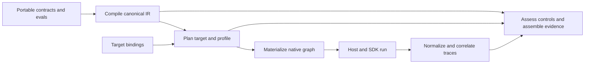

# System Design

Contract4Agents is a source-to-evidence system for contract-first agent teams.

## Authorities

There are exactly two authored authorities:

1. Portable `.contract` and `.eval` source owns semantic intent.
2. `contract4agents.targets.toml` owns target-specific implementations,
   provider selections, environment providers, models, and options.

Canonical IR, generated code, instructions, plans, native objects, trace views,
eval reports, visualizations, diffs, and assurance bundles are derived.

## Compile

The parser produces a syntax-oriented AST with source spans. Semantic analysis
resolves names, types, grants, origins, mappings, controls, rubrics, isolation,
evals, and run specs. The IR builder then emits immutable, deterministic,
kind-qualified semantic entities.

The compiler consumes only canonical IR and produces JSON Schema,
audience-specific instructions, Pydantic/TypeScript/Zod code, reviewer docs,
and the contract digest. It never imports a Python model to discover portable
schema authority.

## Plan

Planning joins canonical IR to one complete target profile and validates target
binding coverage. The provider-neutral plan resolves:

- models and provider options;
- tool, datasource, external-context, and environment bindings;
- grants, authorization, and execution boundaries;
- delegation and handoff mappings;
- explicit and derived controls;
- isolation mechanisms by dimension;
- host obligations, caveats, and expected telemetry.

Every mapping is exact, host-enforced, emulated, degraded, or unsupported.
Required degraded or unsupported semantics stop the lifecycle before execution.

## Materialize

A target provider constructs normal framework-native objects from the immutable
plan. Two-pass graph construction handles forward and cyclic references without
source-order dependence. Native models, instructions, output types, tools,
approvals, composition, context hooks, and isolation mechanisms are validated
against the plan before the graph is returned.

## Run

The selected framework and host execute the native graph. The host owns
credentials, approval decisions, persistence, external services, deployment,
and deterministic workflow. Named contract composition supplies model-selected
delegations and handoffs; it does not become general programming-language
control flow.

## Trace

Normalized schema V2 preserves contract and plan digests, stable semantic IDs,
causal relationships, provider-native correlation, provenance, evidence links,
and audience-safe redaction. It supplements provider trace systems rather than
replacing them.

Completeness is measured against plan telemetry. Event absence cannot prove a
negative claim when instrumentation coverage is incomplete.

## Assure

The common assessor compares normalized evidence to controls and reports
passed, violated, or unverified. Eval campaigns add controlled scenarios,
repeated trials, semantic judges, metrics, uncertainty, and baseline comparison.
Assurance bundles combine declared, planned, observed, and assessed truth for
release review or incident investigation.

## Boundaries

Contract4Agents does not:

- implement arbitrary application branching, retries, loops, or checkpoints;
- invent tool implementations, credentials, approval decisions, or storage;
- erase meaningful provider differences;
- claim filesystem or network isolation without an enforcing provider;
- treat model-facing guidance as enforced policy;
- treat missing evidence as success;
- replace trace storage, dashboards, or a legal certification authority.
