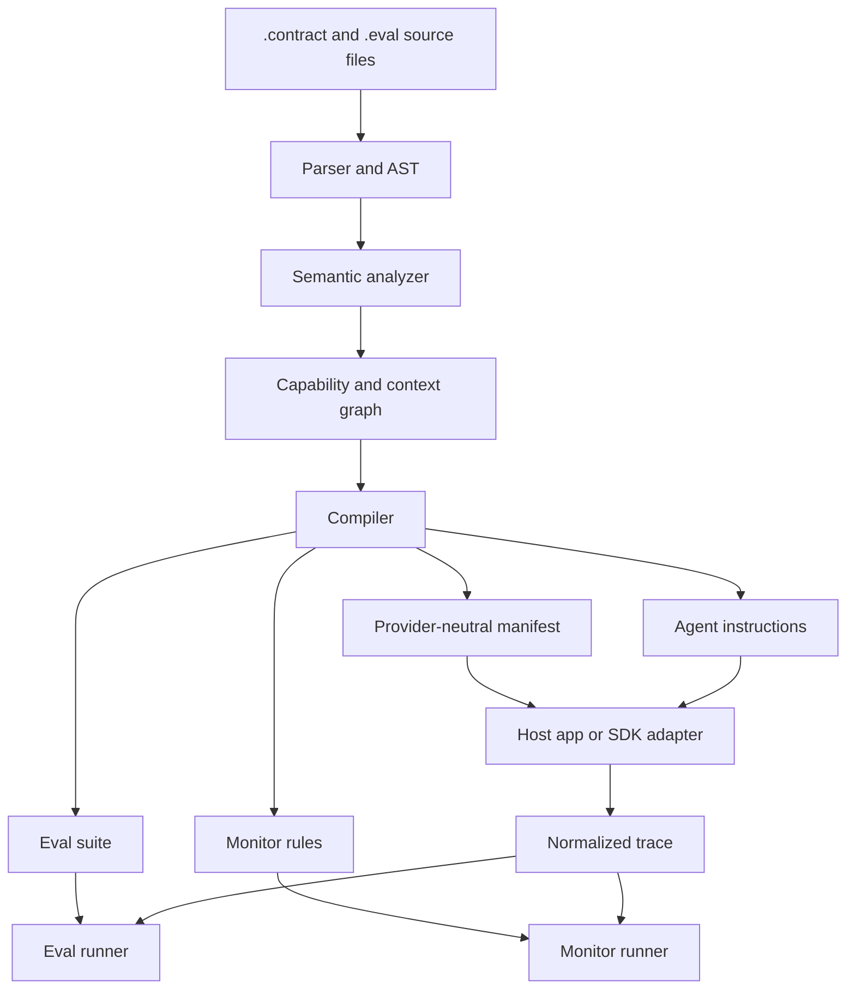

# System Design

Contract4Agents is a source-to-artifacts system for agent contracts. A project contains `.contract` files, `.eval` files, Python tools, Python datasources, and generated outputs.

## Architecture

## Source Inputs

Contract4Agents projects have four primary source inputs:

- `.contract` files define agents, shared types, datasource declarations, guards, assertions, and monitor declarations.
- `.eval` files define offline test and eval cases against agents.
- Python modules implement tools, datasources, adapters, and application-specific runtime code.
- Project configuration declares artifact destinations and host integration policy.

## Core Components

### Parser And AST

The parser reads `.contract` and `.eval` files with Lark grammars, then transforms the parse trees into a typed AST. It preserves source spans for diagnostics and generated documentation.

The AST should be syntax-oriented. It should not perform semantic resolution while parsing.

Parser internals are split by responsibility: source grammar, source transformer, source value helpers, expression grammar, expression runtime evaluation, and expression reference extraction. `contract4agents.parser` and `contract4agents.expressions` remain the public facades; Lark trees stay internal and AST dataclasses remain the compiler-facing representation.

### Semantic Analyzer

The semantic analyzer resolves names and checks contract validity:

- Imported tools, agents, types, and datasources exist.
- Agent parameter types are defined.
- Agent return types are defined.
- Tool, agent, datasource, guard, assertion, and eval references resolve.
- Required context slots can be supplied or resolved.
- Eval expectations reference real output fields and trace events.
- Guards are distinguishable from assertions and semantic evals.

### Capability And Context Graph

The compiler builds a graph of callable agents, tools, datasources, typed context slots, and required approvals.

This graph answers questions such as:

- Can `CustomerGreeter` call `SupportAgent`?
- If `SupportAgent` requires `AccountRejectionStatus`, can it be resolved from available context?
- Which tools are available to an agent?
- Which tools require approval?
- Which constraints must be available to the host or adapter before tool execution?

### Compiler

The compiler turns source contracts into artifacts:

- LLM instructions.
- Provider-neutral manifests.
- Adapter capability metadata.
- Eval packs.
- Monitor packs.
- Generated human docs.

The compiler should be deterministic. If source files and configuration do not change, generated artifacts should be stable.

### Runtime Primitives And Host Integration

Runtime primitives and host integration code consume compiled manifests. Together they support:

- Building the typed context frame.
- Resolving missing context through allowed datasources.
- Rendering context for the model.
- Carrying tool permissions and approval metadata into the host or adapter layer.
- Preserving structured output metadata.
- Capturing trace events.
- Checking run assertions where execution traces and outputs are available.

`contract4agents.runtime` is the canonical public runtime import surface. Runtime implementation details are split into private modules for trace recording, trace JSONL loading, datasource resolution, fake tools, runtime errors, and small import/async utilities. Applications and examples should continue to import runtime primitives from `contract4agents.runtime`.

### Eval Runner

The eval runner executes `.eval` cases against fixture-backed runs. It checks:

- Structured output fields.
- Trace spy assertions.
- Guard and assertion outcomes.
- Optional semantic rubric judgments.
- Regression snapshots where appropriate.

### Monitor Runner

The monitor runner applies monitor rules to recorded traces. It reports contract violations using the same concepts as development evals.

## Host Integration Flow

1. The caller invokes an agent with typed context values.
2. The host application or adapter loads the compiled manifest for the agent.
3. Supplied parameters are validated against the agent signature.
4. Missing required context slots are resolved through allowed datasources.
5. Context slots are rendered for model input.
6. The agent model receives compiled instructions, rendered context, tools, and output schema.
7. Tool calls and subagent calls are checked against manifest permissions before execution.
8. Tool and subagent results are recorded as typed trace events.
9. The final output is validated against the return type.
10. Assertions are checked where their required trace and output data is available.
11. The trace can be used for evals, monitors, debugging, and audit.

## Boundaries

Contract4Agents should own:

- Agent contract syntax.
- Static validation.
- Generated agent instructions.
- Provider-neutral manifests.
- Context resolution rules.
- Eval and trace assertion semantics.
- Trace event schema.

Contract4Agents should not own:

- Business-specific data fetching logic.
- Provider-specific SDK behavior beyond adapter boundaries.
- Secrets management beyond runtime interfaces and redaction contracts.
- Full programming language control flow.

## Design Constraints

- Do not make `.contract` files a disguised imperative language.
- Keep datasources and tools in Python.
- Preserve structured runtime values as long as possible, even though the model ultimately sees rendered text.
- Treat traces as first-class behavior, not debug logs.
- Classify each constraint by enforceability before code generation.
