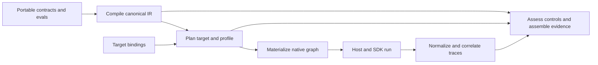

# System Design

Contract4Agents derives agent artifacts from a typed external specification.
The specification makes structure, guardrails, and expectations explicit.
Validation, evals, traces, and assurance help check the generated artifacts and
application behavior against that specification.

Read this page for the system boundaries. For a complete application example,
start with the [adoption tutorial](../tutorials/using-contract4agents-with-an-agent-app.md).
The [semantic model](semantic-model.md) defines the detailed rules.

```mermaid
flowchart LR
    Source["Portable contracts and evals"] --> Compile["Compile canonical IR"]
    Compile --> Plan["Plan target and profile"]
    Bindings["Target bindings"] --> Plan
    Plan --> Materialize["Materialize native graph"]
    Materialize --> Run["Host and SDK run"]
    Run --> Trace["Normalize and correlate traces"]
    Trace --> Assure["Assess controls and assemble evidence"]
    Compile --> Assure
    Plan --> Assure
```

## What Users Write

Agent configuration has two sources:

1. Portable `.contract` and `.eval` source owns semantic intent.
2. `contract4agents.targets.toml` owns target-specific implementations,
   provider selections, environment providers, models, and options.

Canonical IR, generated code, instructions, plans, native objects, trace views,
eval reports, visualizations, diffs, and assurance bundles are derived.
The host supplies tool implementations and application workflow separately.

## Compile

The parser produces a syntax-oriented AST with source spans. Semantic analysis
resolves names, types, grants, origins, mappings, controls, rubrics, isolation,
evals, and run specs. The IR builder then emits immutable, deterministic,
kind-qualified semantic entities.

The compiler consumes only canonical IR and produces JSON Schema,
audience-specific instructions, reviewer docs, and the contract digest.
Explicit code-generation targets separately derive application-language source.
The compiler never imports a Python model to discover portable schema authority.

## Plan

Planning joins canonical IR to one complete target profile and validates target
binding coverage. The provider-neutral plan resolves:

- models and provider options;
- tool, datasource, external-context, and environment bindings;
- grants, authorization, and execution boundaries;
- delegation and handoff mappings;
- explicit and derived controls;
- isolation mechanisms by dimension;
- host obligations, caveats, and expected event types.

Every mapping is exact, host-enforced, emulated, degraded, or unsupported.
Required degraded or unsupported semantics block planning for the selected
target. This is a check on faithful generation, not supervision of the host's
execution.

## Materialize

A target provider constructs normal framework-native objects from the immutable
plan. Two-pass graph construction handles forward and cyclic references without
source-order dependence. Native models, instructions, output types, tools,
approvals, composition, context hooks, and isolation mechanisms are validated
against the plan before the graph is returned.

## Run

The selected framework and host execute the native graph. The host owns
credentials, approval decisions, persistence, external services, deployment,
and deterministic workflow. Named contract composition supplies model-selected
delegations and handoffs; it does not become general programming-language
control flow.

Generated validators and framework hooks implement the declared guardrails
supported by the target. Host obligations describe the integration work that
remains with the application. They do not prescribe a new runtime architecture
or give Contract4Agents authority over host decisions.

## Trace

The normalized trace schema preserves contract and plan digests, stable semantic IDs,
causal relationships, provider-native correlation, provenance, evidence links,
and audience-safe redaction. It supplements provider trace systems rather than
replacing them.

An absent event is useful evidence only if the relevant part of the run was
fully recorded. Trace closure records which attempts and event channels were
captured and identifies the exact trace snapshot. Retry and recovery details
are defined in the [semantic model](semantic-model.md#trace-identity-and-evidence).
The host owns trace storage and workflow recovery.

## Assure

The control assessor compares normalized evidence to controls. A distinct
run-spec assessor compares host-supplied stage observations, derived values,
workflow-completeness evidence, and normalized traces to one selected run spec.
Both report passed, violated, or unverified without executing workflow. Eval
campaigns add controlled scenarios, repeated trials, semantic judges, metrics,
uncertainty, and baseline comparison. Assurance bundles keep control and
run-spec results in separate artifacts while combining declared, planned,
observed, and assessed truth for release review or incident investigation.

## Boundaries

Contract4Agents does not:

- implement arbitrary application branching, retries, loops, or checkpoints;
- invent tool implementations, credentials, approval decisions, or storage;
- erase meaningful provider differences;
- claim filesystem or network isolation without an enforcing provider;
- treat model-facing guidance as enforced policy;
- treat missing evidence as success;
- replace trace storage, dashboards, or a legal certification authority.
